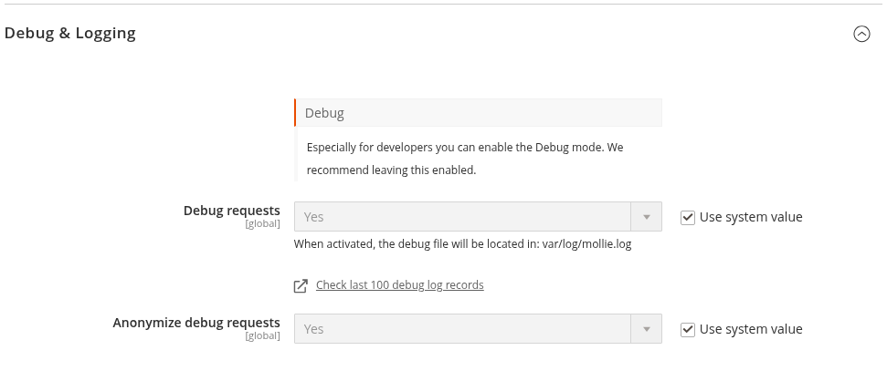

# Configuration

This article covers every general setting available under the **Mollie** tab in Magento Admin for Mollie Payments for Magento 2. Payment-method-specific settings are covered in [Payment Methods](PAYMENT_METHODS.md).

## Prerequisites

- The extension is installed. See [Installation](INSTALLATION.md).
- You have a Mollie API key ready. See [API Keys](API_KEYS.md).

## General

### Enable the Extension

The global on/off switch for all Mollie payment methods at checkout.

1. Go to **Stores → Configuration → Mollie → General**
2. Set **Enabled** to **Yes**
3. Click **Save Config** and flush the cache

Setting this to **No** removes all Mollie payment methods from checkout immediately after the cache is flushed.

### API Keys and Mode

See [API Keys](API_KEYS.md) for the full walkthrough. In summary:

1. Go to **Stores → Configuration → Mollie → General**
2. Set **Modus** to **Test** or **Live**
3. Enter the corresponding API key in **Test API Key** or **Live API Key**
4. Click **Save Config**

The **Profile ID** field is populated automatically when you save a valid API key. It cannot be edited directly.

## Debug and Logging

### Debug Requests

When enabled, all requests to and responses from the Mollie API are written to `var/log/mollie.log`.

This setting is global (not store-view scoped).

1. Go to **Stores → Configuration → Mollie → General → Debug & Logging**
2. Set **Debug requests** to **Yes** or **No**
3. Click **Save Config**

Config path: `payment/mollie_general/debug`. Default: **Yes**. Disable on production stores after confirming the integration works correctly to avoid unbounded log growth.

### Anonymise Debug Requests

When debug logging is on, this option strips personally identifiable information (customer names, email addresses, and card details) from the log entries before they are written.

1. Go to **Stores → Configuration → Mollie → General → Debug & Logging**
2. Set **Anonymize debug requests** to **Yes** or **No**
3. Click **Save Config**

Config path: `payment/mollie_general/anonymize_debug_requests`. Default: **Yes**. This field is only shown when **Debug requests** is enabled.

## Order Management

### Order Statuses

Two statuses control the lifecycle of every Mollie order.

See [Order Management](ORDER_MANAGEMENT.md) for the full walkthrough.

| Field | Config path | Default |
|---|---|---|
| **Status Pending** | `payment/mollie_general/order_status_pending` | `pending_payment` |
| **Status Processing** | `payment/mollie_general/order_status_processing` | `processing` |

1. Go to **Stores → Configuration → Mollie → Order Management → Statuses**
2. Set **Status Pending** to the status to assign when the customer is redirected to the payment page
3. Set **Status Processing** to the status to assign after a confirmed payment
4. Click **Save Config** and flush the cache

### Invoice Creation and Email

1. Go to **Stores → Configuration → Mollie → Order Management → Advanced**
2. Set **Create invoice on successful payment** to **Yes** (default) or **No**
3. Go to **Stores → Configuration → Mollie → Order Management → Invoicing & Surcharges**
4. Set **Send Invoice Email** to **Yes** (default) to send the Magento invoice email to the customer
5. Set **Send Invoice Email For Klarna Orders** to **Yes** (default) or **No** (Klarna sends its own invoice communication)
6. Click **Save Config** and flush the cache

Config paths: `payment/mollie_general/create_invoice`, `payment/mollie_general/invoice_notify`, `payment/mollie_general/invoice_notify_klarna`.

### Surcharge Calculation Basis

These settings control which amounts are included when calculating a percentage-based payment surcharge.

They are store-view scoped.

1. Go to **Stores → Configuration → Mollie → Order Management → Invoicing & Surcharges**
2. Set **Include shipping in Surcharge calculation** to **Yes** to add the shipping amount to the surcharge base, or **No** to use only the subtotal
3. Set **Include discount in Surcharge calculation** to **Yes** to add the discount amount to the surcharge base, or **No** to exclude it
4. Click **Save Config** and flush the cache

Config paths: `payment/mollie_general/include_shipping_in_surcharge`, `payment/mollie_general/include_discount_in_surcharge`. See [Payment Fee](PAYMENT_FEE.md) for the full surcharge configuration.

### Currency

1. Go to **Stores → Configuration → Mollie → Order Management → Triggers & Languages**
2. Set **Use Base Currency** to **Yes** (default) to always send the store's base currency to Mollie, or **No** to send the currency the customer selected on the store view
3. Click **Save Config** and flush the cache

Config path: `payment/mollie_general/currency`. Default: **Yes**.

When set to **No**, verify that the customer's selected currency is enabled in your Mollie profile. Sending an unsupported currency results in a payment error.

### Language of the Payment Page

Controls the locale Mollie uses on its hosted payment page.

1. Go to **Stores → Configuration → Mollie → Order Management → Triggers & Languages**
2. Set **Language Payment Page** to one of:
   - **Autodetect** (default): Mollie detects the locale from the customer's browser. For payment methods that use the Orders API, the store view locale is used instead.
   - **Store Locale**: the locale configured on the current store view, falling back to English if it cannot be determined.
   - A specific locale from the list (for example, `nl_NL`, `de_DE`, `fr_FR`)
3. Click **Save Config** and flush the cache

Config path: `payment/mollie_general/locale`.

## Developer Settings

### Webhooks

By default the extension sends its own store URL as the Mollie webhook endpoint.

Change this only for headless storefronts, PWA integrations, or local development environments where Mollie's servers cannot reach the store directly.

1. Go to **Stores → Configuration → Mollie → Developer Settings → Advanced**
2. Set **Use webhooks** to one of:
   - **Enabled** (default): the extension builds the webhook URL from the store's base URL (`/mollie/checkout/webhook/`) and sends it to Mollie with every order
   - **Custom URL**: the extension uses the URL entered in **Custom webhook url** instead of the built-in endpoint; the order IDs are appended as query parameters automatically
   - **Disabled**: no webhook URL is sent to Mollie; Mollie will not notify the store of payment updates (suitable for local development only)
3. If **Custom URL** is selected, enter the target URL in **Custom webhook url**
4. Click **Save Config** and flush the cache

Config paths: `payment/mollie_general/use_webhooks` (default: `enabled`), `payment/mollie_general/custom_webhook_url`.

**Important:** Disabling webhooks in production means orders are never updated automatically. Only the pending orders cron job (if enabled) will recover payment confirmations.

### Process Transactions in the Queue

When enabled, webhook callbacks are handled asynchronously via the `mollie.transaction.processor` Message Queue (MQ) consumer rather than synchronously during the webhook request. This prevents webhook timeouts on stores where post-payment work (invoice creation, confirmation emails, and ERP calls) takes a long time.

1. Go to **Stores → Configuration → Mollie → Developer Settings → Advanced**
2. Set **Process transactions in the queue** to **Yes** (default) or **No**
3. Click **Save Config**

Config path: `payment/mollie_general/process_transactions_in_the_queue`. Default: **Yes**.

If the queue consumer is not running, webhooks are accepted but orders are not updated. A warning appears next to this field when the queue is not configured correctly. Run the self-test from the General section to diagnose queue issues. See [Best Practices](BEST_PRACTICES.md) for consumer setup guidance.

### Tracking Cookies

The tracking cookies table maps browser cookies to query-parameter aliases. For each row, the extension reads the named cookie at the moment the customer submits the checkout and appends its raw value as a query parameter on the Mollie redirect URL under the given alias. The same value is persisted on the order success page so analytics scripts can read it for attribution.

1. Go to **Stores → Configuration → Mollie → Developer Settings → Advanced**
2. In the **Tracking cookies** table, click **Add** to add a row
3. Enter the **Cookie name** (the name of the browser cookie to capture, for example `_ga`)
4. Enter the **Alias** (the query parameter name to use, for example `clientId`)
5. Repeat for each cookie to capture
6. Click **Save Config** and flush the cache

Config path: `payment/mollie_general/tracking_cookies`. The default configuration captures `_ga` under the alias `clientId`.

Rows with a blank cookie name or a duplicate alias are silently skipped. See [Tracking](TRACKING.md) for the full tracking integration guide.

#### Custom Return URL

After a payment completes, Mollie redirects the customer back to the store. By default this is the Magento-hosted process URL. A PWA can override it with a custom URL.

1. Go to **Stores → Configuration → Mollie → Developer Settings → PWA Storefront Integration**
2. Set **Use custom return url?** to **Yes**
3. Enter the target URL in **Custom return url**
4. Click **Save Config** and flush the cache

Config paths: `payment/mollie_general/use_custom_redirect_url` (default: **No**), `payment/mollie_general/custom_redirect_url`.

The custom return URL supports the following placeholders:

| Placeholder | Value |
|---|---|
| `{{order_id}}` | Entity ID of the order |
| `{{increment_id}}` | Increment ID (order number) |
| `{{payment_token}}` | Generated payment token |
| `{{order_hash}}` | Entity ID encrypted and base64-encoded |
| `{{base_url}}` | Store base URL |
| `{{unsecure_base_url}}` | Store base URL (unsecure) |
| `{{secure_base_url}}` | Store base URL (secure) |

The URL must include the protocol (`https://`). The **Custom return url** field is only shown when **Use custom return url?** is set to **Yes**.

#### Custom Payment Link URL

The payment link URL is used by the Second Chance Email feature and the Payment Link payment method. Override it when the customer-facing link must resolve through a PWA or custom domain.

1. Go to **Stores → Configuration → Mollie → Developer Settings → PWA Storefront Integration**
2. Set **Use custom payment link url?** to **Yes**
3. Enter the target URL in **Custom payment link url**
4. Click **Save Config** and flush the cache

Config paths: `payment/mollie_general/use_custom_paymentlink_url` (default: **No**), `payment/mollie_general/custom_paymentlink_url`.

The `{{order}}` placeholder is required in the URL — it is replaced with the encrypted entity ID of the order. The field is only shown when **Use custom payment link url?** is set to **Yes**.

## Next Steps

- [API Keys](API_KEYS.md) — Entering and rotating API keys
- [Payment Methods](PAYMENT_METHODS.md) — Enabling and configuring individual payment methods
- [Order Management](ORDER_MANAGEMENT.md) — Statuses, invoicing, capture, and refunds
- [Second Chance Email](SECOND_CHANCE_EMAIL.md) — Automated payment reminders
- [Payment Fee](PAYMENT_FEE.md) — Surcharge configuration
- [Tracking](TRACKING.md) — Cookie and analytics tracking
- [Best Practices](BEST_PRACTICES.md) — Recommended production settings
- [Troubleshooting](TROUBLESHOOTING.md) — Common configuration issues
