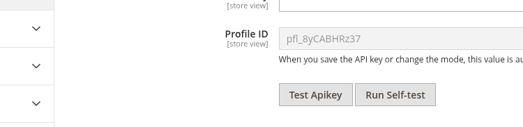
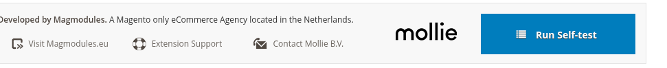

# Quickstart: Mollie Payments for Magento 2

This guide gets you from a fresh install to processing test payments in under 15 minutes. For deeper configuration options, see the other articles in this documentation.

## Prerequisites

Before you start, make sure you have:

- Magento **2.4.5 or higher**
- PHP **8.1 or higher**
- A [Mollie account](https://www.mollie.com/dashboard/signup) (free to create)
- Composer installed on your server

## Step 1: Install the Extension

Run the following commands from your Magento root:

```bash
composer require mollie/magento2
php bin/magento module:enable Mollie_Payment
php bin/magento setup:upgrade
php bin/magento setup:di:compile
php bin/magento cache:flush
```

For production environments, also deploy static content:

```bash
php bin/magento setup:static-content:deploy
```

## Step 2: Get Your API Keys

1. Log in to your [Mollie Dashboard](https://www.mollie.com/dashboard)
2. Go to **Developers**
3. Click **Create access token**
4. Enter a description, select **Standard API key**, select your profile, and choose **Test** mode
5. Copy the generated key

## Step 3: Enter Your API Key in Magento

1. In Magento Admin, go to **Stores → Configuration → Mollie → General**
2. Expand **Mollie Configuration**
3. Set **Enabled** to **Yes**
4. Paste your **Test API key** in the **Test API Key** field
5. Set **Modus** to **Test**
6. Click **Save Config**
7. Clear the cache: **System → Cache Management → Flush Magento Cache**


After saving, the **Profile ID** field is populated automatically. Click **Test Apikey** to confirm the key is accepted by the Mollie API before continuing.



## Step 4: Enable Payment Methods

1. Go to **Stores → Configuration → Mollie → Payment Methods**
2. Scroll to the individual payment method sections (iDEAL, Credit Card, etc.)
3. Set **Enabled** to **Yes** for each method you want to offer
4. Configure the **Title** shown to customers if desired
5. **Save Config** and flush the cache

**Tip:** Enable iDEAL or Credit Card first to verify the setup works before enabling all methods.

## Step 5: Place a Test Order

1. Go to your storefront and add a product to the cart
2. Proceed to checkout
3. Select a Mollie payment method (e.g. iDEAL)
4. Complete the payment using Mollie's **test credentials**:
   - For iDEAL: select any bank, any amount
   - For Credit Card: use test card number `4543 4740 0224 9996`, expiry `12/25`, CVV `123`
5. You should land on the order success page
6. In Magento Admin under **Sales → Orders**, verify the order status is **Processing**

## Step 6: Run the Self-test

Before going live, run the built-in self-test to catch any configuration issues. It checks webhook reachability, queue setup, Apple Pay domain validation, and more.

1. Go to **Stores → Configuration → Mollie → General**
2. Click **Run Self-test**



Resolve any errors shown before proceeding. Warnings are advisory but worth reviewing.

## Step 7: Go Live

When you are ready to accept real payments:

1. Go to **Stores → Configuration → Mollie → General**
2. Replace the Test API key with your **Live API key**
3. Set **Modus** to **Live**
4. Click **Save Config** and flush the cache
5. Click **Test Apikey** to verify the live key is valid
6. Place a real test order with a small amount to confirm everything works end-to-end

**Important:** Make sure your store is accessible over HTTPS. Mollie requires a valid SSL certificate to process live payments.

## Next Steps

- [API Keys](API_KEYS.md) — Multi-store key setup, test vs. live environments
- [Payment Methods](PAYMENT_METHODS.md) — Full list of methods and their individual settings
- [Configuration](CONFIGURATION.md) — All general settings explained
- [Order Management](ORDER_MANAGEMENT.md) — Order statuses, invoicing, and refunds
- [Troubleshooting](TROUBLESHOOTING.md) — Common issues and how to fix them
