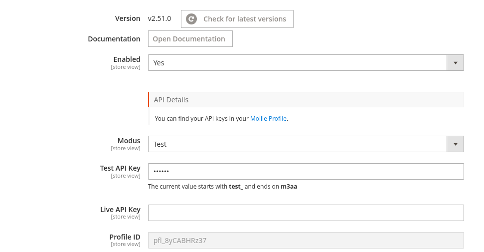
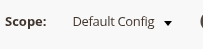
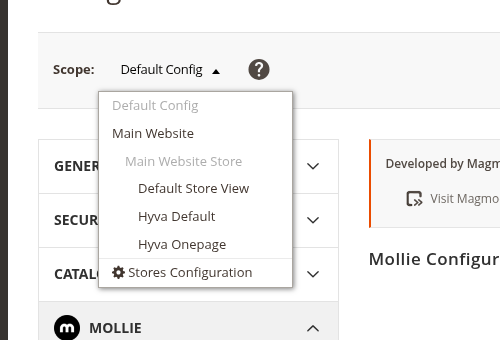

# API-sleutels

Dit artikel legt uit hoe je je Mollie API-sleutels vindt, ze invoert in Magento, wisselt tussen test- en live-modus, en afzonderlijke sleutels per website instelt in een multi-store omgeving.

## Je API-sleutels vinden

1. Log in op het [Mollie Dashboard](https://www.mollie.com/dashboard)
2. Ga naar **Developers**
3. Klik op **Create access token**
4. Voer een omschrijving in voor de sleutel
5. Selecteer **Standard API key**
6. Selecteer het profiel om de sleutel aan te koppelen
7. Kies de API-modus: **Live** of **Test**
8. Kopieer de gegenereerde sleutel

## Sleutels invoeren in Magento Admin

1. Ga naar **Stores → Configuration → Mollie → General**
2. Klap **Mollie Configuration** uit
3. Plak de **Test API-sleutel** in het veld *Test API Key*
4. Plak de **Live API-sleutel** in het veld *Live API Key*
5. Zet **Modus** op **Test** of **Live**, afhankelijk van welke sleutel actief moet zijn
6. Klik op **Save Config**
7. Ga naar **System → Cache Management** en klik op **Flush Magento Cache**

Na het opslaan valideert de extensie de sleutel via de Mollie API en vult het veld **Profile ID** automatisch in. Onder elk sleutelveld staan de eerste vijf en laatste vier tekens van de opgeslagen sleutel ter verificatie.

## Schakelen tussen test- en live-modus

De instelling **Modus** bepaalt welke sleutel gebruikt wordt voor alle transacties. Het is voldoende om alleen de modus te wijzigen; beide sleutels blijven opgeslagen.

1. Ga naar **Stores → Configuration → Mollie → General → Mollie Configuration**
2. Zet **Modus** op **Test** of **Live**
3. Klik op **Save Config** en leeg de cache

In testmodus worden geen echte betalingen verwerkt. Gebruik [Mollie's testgegevens](https://docs.mollie.com/docs/testing) om betaaluitkomsten te simuleren.

## Multi-store configuratie

API-sleutels kunnen worden ingesteld op het niveau van de standaardconfiguratie, de website of de store view. Hierdoor kun je verschillende Mollie-accounts of profielen per website gebruiken.

1. Gebruik in Magento Admin de **Scope**-schakelaar bovenaan de configuratiepagina om de website of store view te selecteren

   

   Klik erop om de beschikbare websites en store views te tonen:

   

2. Ga naar **Stores → Configuration → Mollie → General → Mollie Configuration**
3. Vink **Use Default** uit naast de API-sleutelvelden

   

4. Voer de sleutels in voor dit bereik
5. Stel de **Modus** in voor dit bereik
6. Klik op **Save Config** en leeg de cache

Herhaal dit voor elke website die afzonderlijke sleutels vereist.

## Een sleutel rouleren of vervangen

Genereer een nieuwe sleutel in het Mollie Dashboard en werk deze bij in Magento. De extensie behoudt de vorige sleutel als fallback, zodat webhooks die onderweg zijn niet verloren gaan tijdens de overstap.

1. Genereer een nieuwe sleutel in het Mollie Dashboard via **Developers → API keys**
2. Ga in Magento Admin naar **Stores → Configuration → Mollie → General → Mollie Configuration**
3. Verwijder de bestaande sleutel en plak de nieuwe sleutel
4. Klik op **Save Config** en leeg de cache

## Volgende stappen

- [Configuratie](CONFIGURATION.md) — Alle algemene instellingen
- [Betaalmethoden](PAYMENT_METHODS.md) — Individuele betaalmethoden inschakelen
- [Problemen oplossen](TROUBLESHOOTING.md) — Veelvoorkomende problemen, inclusief API-sleutelfouten
